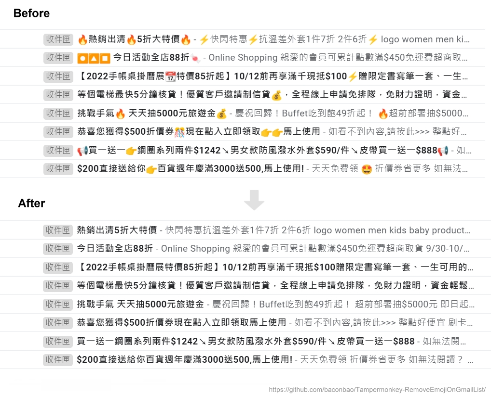

# [Tampermonkey] Remove Emoji on Gmail's Mail List

A Tampermonkey script which can be used to remove emoji on the mail list of Gmail.

## Installation

1. Add `Tampermonkey` extension into browser (e.g. [Chrome extension store](https://chrome.google.com/webstore/detail/tampermonkey/dhdgffkkebhmkfjojejmpbldmpobfkfo))
2. Go to Greasy Fork page to `install this script`: [Greasy Fork](https://greasyfork.org/scripts/433292-gmail-remove-emoji-on-mail-list)

## Author

BaconBao
